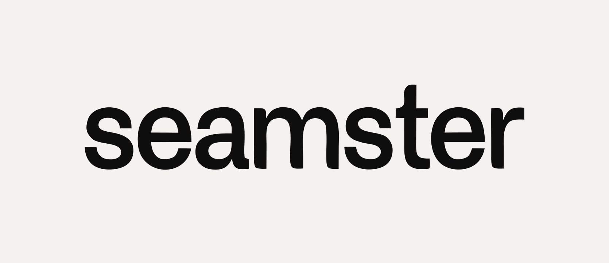

# Словесный знак seamster

| файл | где применять |
| --- | --- |
| `seamster.svg` | основной: тёмный знак `#0E0E0E` на светлом, фон прозрачный |
| `seamster-paper.svg` | тот же знак цветом бумаги `#F4F2EF` — для тёмных подложек |
| `seamster-card.svg` | готовая карточка на фирменной бумаге: превью, шапки, соцсети |
| `source/v09-seamsterly.svg` | исходная генерация, из которой взяты контуры |

Пересобрать: `pnpm brand:logo`.

## Знак — контуры, а не шрифт

Гарнитуры, которой набрано слово, у нас нет: есть только её контуры в исходном
файле. Отсюда два следствия, и оба обязательны.

**Знак нельзя набрать заново.** Ни в макете, ни в вёрстке, ни «похожим
гротеском». Любое место, где нужен знак, берёт готовый SVG.

**Заголовки набираются нашей гарнитурой** — Sora из хендоффа, а не знаком.
Слово в тексте — это текст, знак — это картинка; они не заменяют друг друга.

## Правила

Охранное поле со всех сторон — не меньше половины высоты знака. Внутрь поля не
заходит ничто: ни текст, ни край макета, ни соседняя графика.

Минимальный размер — 96 px по ширине на экране, 25 мм в печати. Ниже слово
перестаёт читаться раньше, чем это становится заметно на макете.

Нельзя: растягивать по одной оси, менять межбуквенные зазоры, добавлять обводку,
тень или градиент, разбирать на буквы, ставить на фотографию без плашки.

Цвет — только `#0E0E0E` или `#F4F2EF`. Знак одноцветный по устройству: он
собран одним путём с `fill-rule="evenodd"`, и второй цвет ему негде взять.

## Что отклонено

В исходном варианте сквозь «l» и «y» шла пунктирная строчка. Хвост отрезан, и
строчка ушла с ним. Её переносили кистью оригинала на «seam» (корень слова —
шов) и на «ster» — оба раза мимо: между узкими буквами хвоста было много фона и
пунктир читался ритмом, а на плотных буквах та же линия читается зачёркиванием и
сыплется сором в мелком кегле. Возвращать не нужно, это уже проверено.
